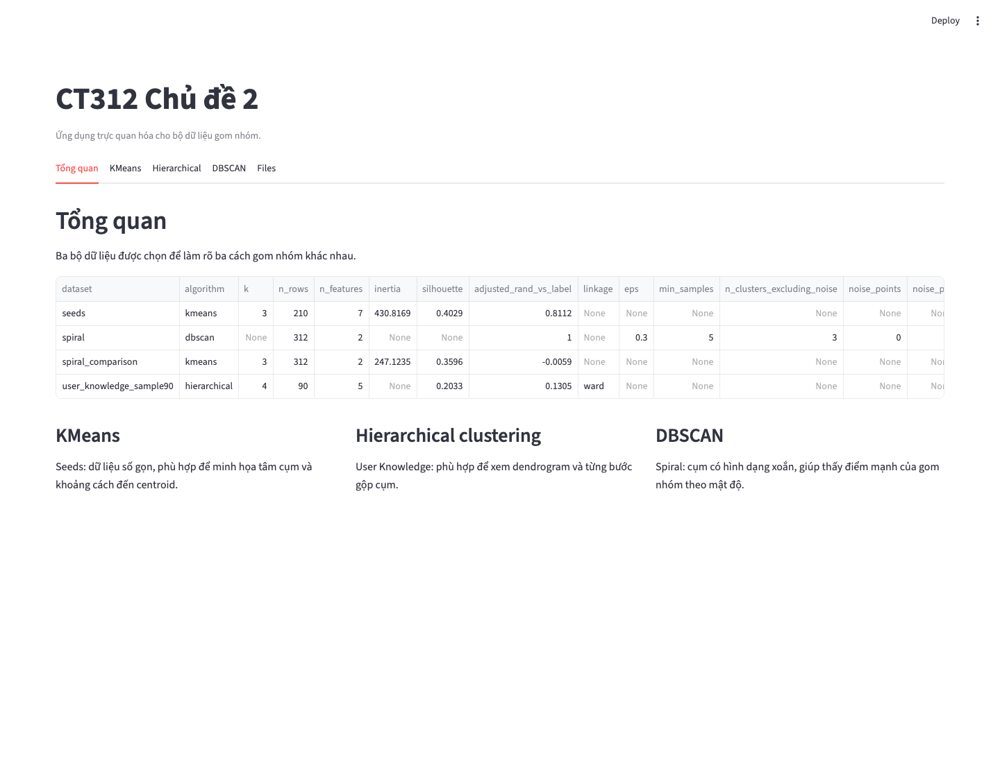
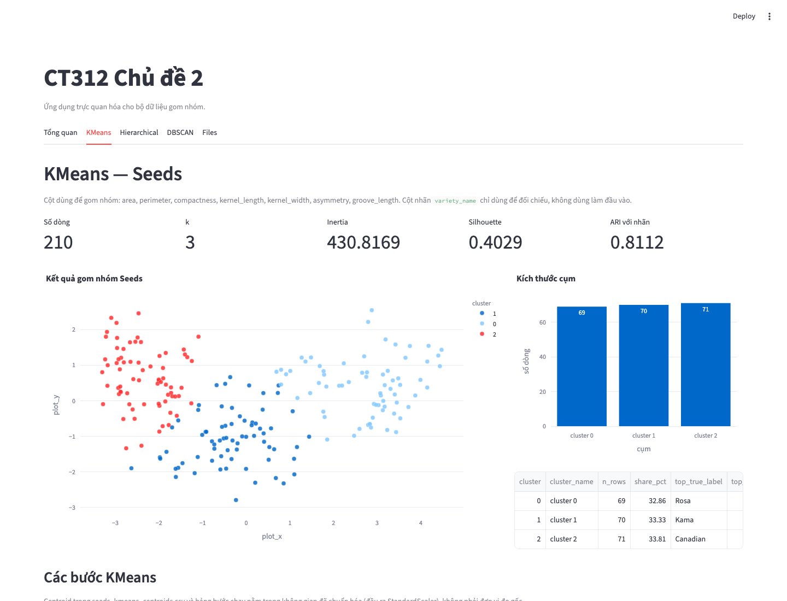
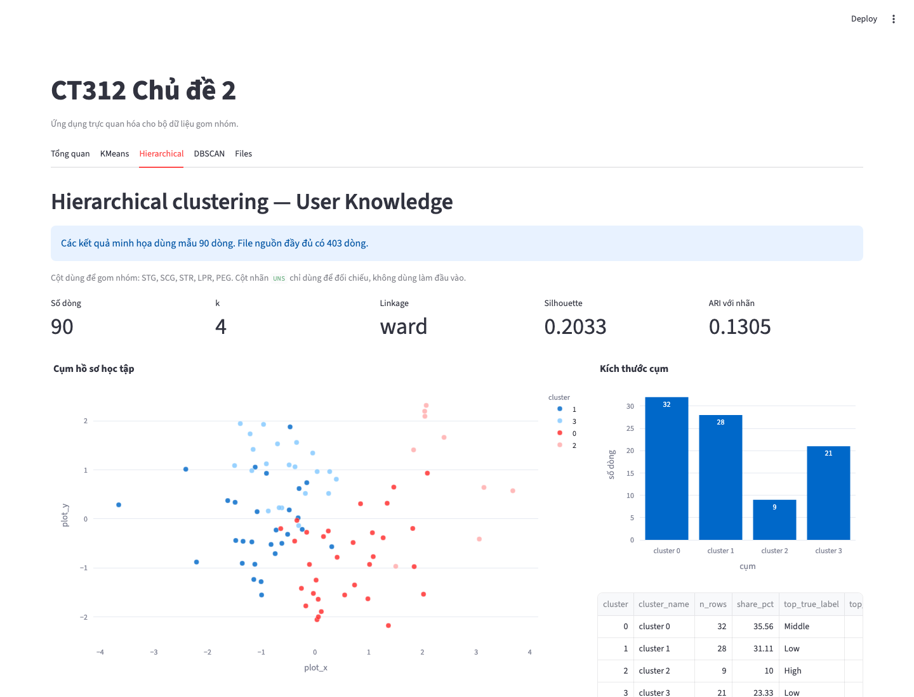
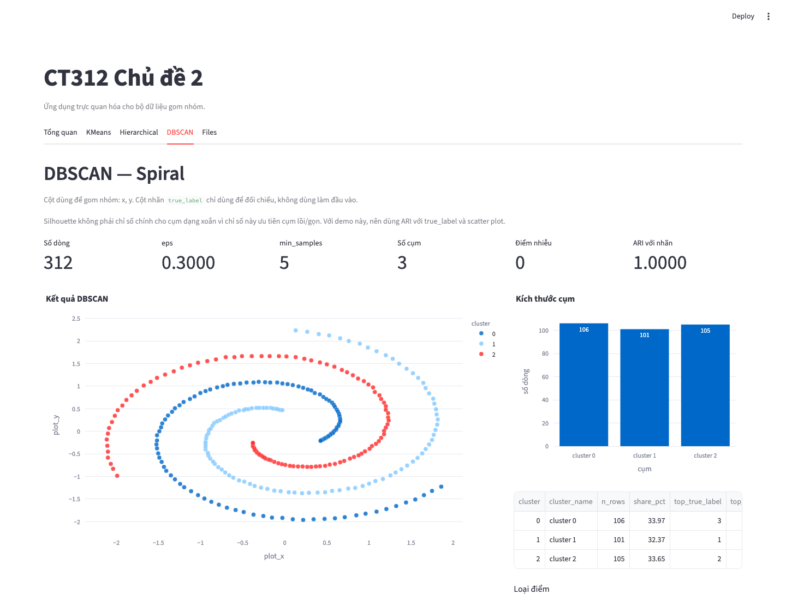

# CT312 Chủ đề 2 - Website học gom nhóm dữ liệu

Repo này chứa dữ liệu mẫu, kết quả xử lý và ứng dụng Streamlit dùng để trực quan hóa ba giải thuật gom nhóm: **KMeans**, **hierarchical clustering** và **DBSCAN**.

## Nội dung chính

- Dữ liệu mẫu đã chuẩn bị sẵn cho từng giải thuật.
- Kết quả gom nhóm ở dạng CSV/JSON để web app đọc trực tiếp.
- Hình minh họa: scatter plot, dendrogram, k-distance, so sánh DBSCAN với KMeans.
- Ứng dụng Streamlit trong `app/` để nhóm tự kiểm tra và trình bày nhanh.

## Cài đặt

```bash
python -m pip install -e .
python -m pip install -r app/requirements.txt
```

## Tạo lại dữ liệu và kiểm tra

```bash
python scripts/topic2/01_prepare_demo_data.py
python scripts/topic2/02_validate_handoff.py
```

## Chạy ứng dụng trực quan hóa

```bash
streamlit run app/streamlit_app.py
```

## Trực Quan Hoá

<p>
  
  
</p>
<p>
  
  
</p>

## Cấu trúc quan trọng

```text
data/topic2/examples/                 # dữ liệu CSV mẫu
outputs/topic2/results/               # kết quả gom nhóm dạng CSV/JSON
outputs/topic2/plots/                 # hình xuất sẵn
docs/topic2_dataset_notes.md          # ghi chú dữ liệu và cách xử lý
docs/topic2_visualization_contract.json
app/streamlit_app.py                  # ứng dụng trực quan hóa
screenshots/                          # ảnh chụp màn hình để gửi nhóm
```

## Khi làm việc nhóm

- Nhánh chính: `main`.
- Khi làm tính năng mới hoặc sửa lỗi, tạo nhánh riêng từ `main`:

  ```bash
  git checkout main
  git pull --rebase origin main
  git checkout -b ten-tinh-nang
  ```

  Ví dụ: `feat/web-upload`, `fix/dendrogram-labels`.

- Commit message viết bằng tiếng Anh, theo dạng conventional commit:
  - `feat: add new feature`
  - `fix: fix bug`
  - `docs: update documentation`
  - `refactor: clean up code without behavior changes`
- Trước khi mở pull request, rebase nhánh của mình lên `main` mới nhất:

  ```bash
  git fetch origin
  git rebase origin/main
  ```

  Nếu có conflict, sửa conflict rồi chạy:

  ```bash
  git add <file-da-sua>
  git rebase --continue
  ```

  Khi rebase xong, push lại nhánh bằng:

  ```bash
  git push --force-with-lease
  ```

  Không dùng `git push --force`.

- Xong nhánh thì tạo pull request vào `main`. Mô tả rõ đã làm gì, càng cụ thể càng tốt.
- Ít nhất một người khác review rồi mới merge.
- Không push trực tiếp lên `main`, trừ khi pull request đã được duyệt.

## Bộ dữ liệu được chọn

| Giải thuật | Bộ dữ liệu | Lý do chọn |
|---|---|---|
| KMeans | UCI Seeds | Dữ liệu số gọn, có 3 nhóm tự nhiên, phù hợp để minh họa centroid. |
| Hierarchical clustering | UCI User Knowledge Modeling | Dữ liệu liên quan đến học tập, dễ trình bày dendrogram và các bước gộp cụm. |
| DBSCAN | UEF/SIPU Spiral | Cụm dạng xoắn, giúp thấy rõ điểm mạnh của DBSCAN trên cụm không lồi. |

Các cột nhãn như `variety_name`, `UNS`, `true_label` chỉ dùng để đối chiếu và giải thích. Không dùng các cột này làm đầu vào gom nhóm.

## Ghi chú cho web app chính

File `docs/topic2_visualization_contract.json` mô tả các file đầu vào, cột cần dùng và ý nghĩa từng artifact. Nếu web app cần đọc kết quả có sẵn, bắt đầu từ file này.
